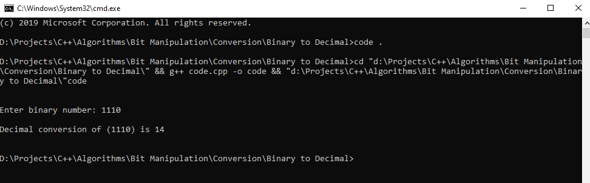

# Binary to Decimal convertor

## Logic behind the binary-to-ecimaly conversion

We iterate the entire binary code in reverse order and multiple individual bits with pow(2,exponential). The exponential increases from 0 to the (n-1). Then we add all the multiplied results and we get the decimal output. The image explains the entire process with an example.

## Output for the code

## Libraries Used

>#include "iostream"
###
>#include "cmath"

### Thanks For Reading
